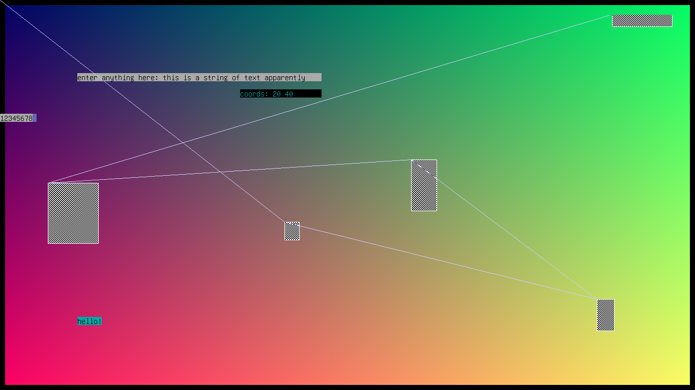

# What is this?

I wrote this simple GUI library for a school CS project
because my teacher told me that, and I quote,
"console interface is scary to most people", and he wanted
me to incorporate some form of GUI. Because at the time I was
too lazy to learn a big framework like GTK3, or write up an
OpenGL backend to my supposedly simple program, I decided to
use the simplest graphics interface that I could reasonably
work with - the linux framebuffer.

Interfacing is as simple as literally memory mapping the file
descriptor of the framebuffer to a uint8\* and writing to each
of the values as if they are rgba values of a pixel.

Unfortunately it is not quite as good as it seems. This "gui"
utilizes the CPU for all of its rendering and isn't hardware
accelerated at all. So it can't do fancy stuff such as real
time 3d graphics, a task that is pretty easy with OpenGL.

Writing to the framebuffer also interferes with the builtin
text printing of the console. So, if you call `printf()`, or
something like that, it will print text over whatever pixels
were originally set.

There also isn't really a good way to capture keypresses
and forward them to the program. I tried ncurses at first, but
ran into issues: ncurses refreshes its own 'character grid'
anytime the program polls for keypresses, which obviously is
a problem. Rather than mess around with that, I thought up
a probably even worse solution. But it works, so who cares.

Using ANSI escape characters, I can hide the cursor, and then
move it to an arbitrary position on the screen, and then make
it visible again, and from there accept normal input from, say,
`scanf()` or `cin`.

It works decently well with only one real issue: there is no
control over how far right the cursor can move, so if the user
holds down a key or types a lot, the text will overflow outside
whatever intended text box. But that's probably fine!

# what the heck are these files?

The two header files encompass everything necessary.
You just need to `#include` them in whatever c++ program
you are writing and it will work.

initially when experimenting I wrote everything in one file
(`poc.c`) and without any c++ features like `std::string`. It
has some basic shading and drawing.

I migrated the main rendering code onto `tgui.h`, and at that
point started tackling the issue of input/output. For that I
created the `tgin.h` header which contains helper functions
to move around the cursor, and set color attributes, etc.

# how do I use this library?

The short answer is you shouldn't. It might have residual
bits of code hardcoded to my laptop specs, and I'm not sure.

But the bigger issue is that the rendering here is so low
level that it only visibly shows up when I am running my
laptop in pure TTY. (check out my [profile](https://github.com/vmhl87)
to see my setups)

When running this GUI over an existing GUI like X11, the changes
to the framebuffer simply don't show up. So this GUI would really
only be useful if you are, like me, very odd in your choice of
technology.

# OK, I do really want to use this though

Colors are represented weirdly. They are stored as 4-element char
arrays, because chars are usually equivalent to 8-bit integers.

However most of the time they are represented either as 3 integers,
one for each color field (r, g, b), or as *integerized colors*.

Integerized colors essentially pack all three 8-bit integers into
one 32-bit integer. There is a helper function for this:

`to_color(r, g, b)`

There are several helpers to draw shapes.

draw a filled rectangle:

`rect(x, y, w, h, r, g, b)` where (x,y) is the top left corner
and (r,g,b) is the fill color

draw a rectangle outline:

`rectl(x, y, w, h, r, g, b)`

shade a rectangle with some arbitrary function:

`shade(x, y, w, h, func), func(x, y)` where `func` accepts the coordinates
of pixel to shade and returns the *integerized color* it should be

There is a generic function to draw a line:

`line(x1, y1, x2, y2, r, g, b)`

However, for horizontal and vertical lines, there are slightly faster
functions that use linear stepping rather than bresenham.

`_hline(x1, x2, y, r, g, b)`

`_vline(x, y1, y2, r, g, b)`

Of course you can also plot points directly to the framebuffer.

`pt(x, y, r, g, b)`

To open and close the framebuffer you can use `openfb()` and `closefb()`.
You can also clear the entire buffer with `blank()`.

There is no way (yet?) to draw text using the framebuffer itself, but
you can do it by repositioning the cursor and printing.

`tgin.h` is responsible for these pieces of code.

Most importantly you can hide and show the cursor with `curs_set(b)`
where `b` is `0` or `1`, corresponding to hidden and visible.

You can manually reposition the cursor to an arbitrary position with
`move(x, y)`. It's just a wrapper for an ANSI code.

There are wrappers for ANSI colors/attributes/etc:

`attr(attribute)` where attribute is one of `BOLD`, `NONE`, `BLACK`,
`GREEN`, etc. (find these at line 46 of `tgin.h`)

to set a background color call `attr(BG(color))` where `color` is one
of the constants in `tgin.h`.

You can print out a centered string of text with:

`center(s, x, y)`, or if `x` and `y` are ommitted, at the center
of the screen.

The coordinates are represented not in pixels but in characters.
These are probably personalized to your device, but on my laptop there are
`W_CHARS` chars in each row and `H_CHARS` chars in each column, and each char
is `W_CHAR` x `H_CHAR` in dimensions. (These are also constants in `tgin.h`)

You can place a text box at an arbitrary location:

`text_box(x, y, width, prompt)` where `prompt` is optionally a character
literal. It returns the string entered by the user.

That's really most of what this graphics "library" does. Have fun!

Feel free to look at the demo programs if you aren't sure how to use
stuff here. They *should* be decently commented out.

And, if you're coming here trying to learn how to mess around with the
linux framebuffer for direct rendering, I hope this helps!

## screenshots!

